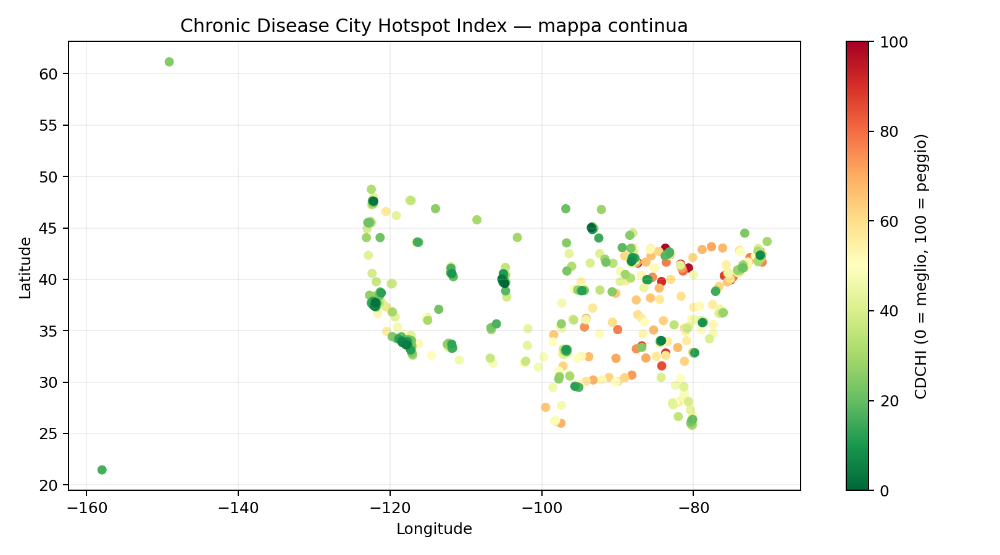

# Chronic Disease City Hotspot Index (CDCHI)

Indice composito **0–100** (più alto = peggio) che confronta la **vulnerabilità cronica** delle città USA usando esclusivamente il dataset Kaggle *500 Cities*.

## Dati
- `500_Cities_CDC.csv` (non versionato).
- Output: `project/outputs/cdchi_final.csv`, `project/outputs/map_cities_continuous.png`, `project/outputs/map_cities_top_bottom.html`.

## Metodo (sintesi)
1. **Standardizzazione**: z-score delle prevalenze (%): Obesità, Diabete, Ipertensione (BPHIGH), COPD, Inattività (LPA), Poor mental health (PHLTH).
2. **Domini**: cardio = (OBESITY, DIABETES, BPHIGH); resp = (COPD); behav = (LPA, PHLTH).
3. **Indice**: media dei domini → **rescaling 0–100** (min–max).
4. **Robustezza**: PCA(1) produce ranking ~identico (ρ Spearman ≈ 1.00).

## Come riprodurre (Colab)
```bash
python src/indicator.py --input data/500_Cities_CDC.csv --output outputs/cdchi_final.csv
```

## Risultati
**Mappa interattiva**: apri `project/outputs/map_cities_top_bottom.html`



### Top 10 (CDCHI più alto)
| City | State | CDCHI |
|---|---:|---:|
| Detroit | MI | 100.0 |
| Gary | IN | 99.9 |
| Flint | MI | 98.7 |
| Youngstown | OH | 97.0 |
| Camden | NJ | 95.1 |
| Cleveland | OH | 92.5 |
| Dayton | OH | 91.4 |
| Macon | GA | 89.8 |
| Reading | PA | 87.5 |
| Birmingham | AL | 86.0 |

### Bottom 10 (CDCHI più basso)
| City | State | CDCHI |
|---|---:|---:|
| Plymouth | MN | 0.0 |
| Centennial | CO | 0.3 |
| San Ramon | CA | 2.7 |
| Boulder | CO | 2.8 |
| Bellevue | WA | 3.0 |
| Pleasanton | CA | 4.1 |
| Newport Beach | CA | 4.4 |
| Johns Creek | GA | 5.0 |
| Redondo Beach | CA | 6.0 |
| Sunnyvale | CA | 6.2 |

## Interpretazione
- **CDCHI** sintetizza tre aree: **cardio**, **resp** e **behav** (z-score > 0 = peggio della media).
- Usa le colonne `domain_*` per capire **quale dominio** pesa di più per ciascuna città.
- L’indice è pensato per **prioritizzare** interventi di prevenzione e per **confronti relativi**.

## Robustezza (Sensitivity)
- Pesi diversi (cardio 0.5, resp 0.25, behav 0.25): Spearman=0.997, max|rank shift|=43.
- Interpretazione: la classifica è quasi invariata; eventuali spostamenti riguardano soprattutto la fascia centrale.
- File: `outputs/sensitivity_summary.csv` e `outputs/sensitivity_top_movers.csv`.
